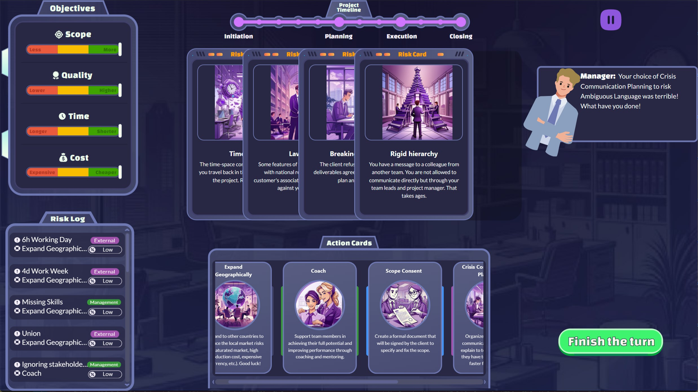
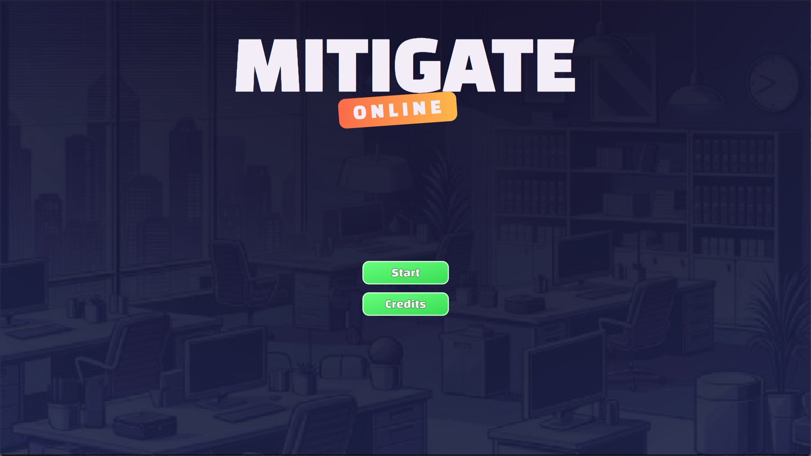

# Mitigate Online

## Pildid



Mitigate Online on veebipõhine projektijuhtimise mäng, mis on loodud Tallinna Ülikooli DTI suvepraktika raames. Projekti tellis: Martin Sillaots.

Projekti peamine eesmärk on anda mängijale esmane projektijuhtimise kogemus, kus ta näeb millised riskid võivad projektidega kaasneda.

Mäng koosneb 12 voorust, kus igal voorul esitatakse mängijale, kaartide näol riskid, mis võivad enne vooru lõppu juhtuda. Mängija eesmärgiks on strateegiliselt kasutada vastumeetme kaarte, et riskid läbi ei läheks ning tema projekti ressurssid punasesse ei kukuks. 

### Arendamiseks kasutatud programmid ja raamistikud:

- Visual Studio Code
- Svelte 5
- node.js
- Vähesel määral Chat gpt 3.5

## Autorid:

- Hugo Luca Tigane
- Madis Valliste
- Jan-Erich Sigur
- Germo Tael
- Kaspar Merisalu
- Kadir Alp Yalti

# Arenduskeskkonna Paigaldusjuhend

## Eelnevalt peab süsteemis olema paigaldatud:
- [Node.js](https://nodejs.org/)

## Sammud:
1. **Klooni või lae alla hoidla sisu**
   - Kui laadisite alla ZIP-faili, siis pakkige see lahti.

2. **Avage terminal**
   - Võite kasutada terminali, PowerShelli või Command Prompti.

3. **Liikuge veebirakenduse kataloogi**
   - Kasutage käsklust:
     ```sh
     cd {kataloogi täielik rada}
     ```
     (Näiteks: `cd C:\Users\TeieKasutajanimi\ProjektiKaust`)

4. **Installige vajalikud lisamoodulid**
   - Käivitage käsklus:
     ```sh
     npm install
     ```
   - Kui esineb viga, proovige:
     ```sh
     npm install --force
     ```
     (see sunnib sõltuvuste allalaadimise lõpuni).

5. **Käivitage veebirakendus**
   - Tehke rakendus oma süsteemis kättesaadavaks:
     ```sh
     npm run dev
     ```
     (käivitab mängu localhostis, tüüpiliselt localhost:5174)


# Svelte Rakenduse Veebis Serveerimiseks Ettevalmistamise Juhend

## Eeltingimused
Veenduge, et teie süsteemis on paigaldatud järgmised programmid:
- [Node.js](https://nodejs.org/)

## Sammud

1. **Klooni või lae alla hoidla sisu**
   - Kui laadisite alla ZIP-faili, siis pakkige see lahti.

2. **Avage terminal**
   - Võite kasutada terminali, PowerShelli või Command Prompti.

3. **Liikuge projekti kataloogi**
   - Kasutage käsklust:
     ```sh
     cd {kataloogi täielik rada}
     ```
     (Näiteks: `cd C:\Users\TeieKasutajanimi\ProjektiKaust`)

4. **Installige vajalikud lisamoodulid**
   - Kasutage käsklust:
     ```sh
     npm install
     ```
   - Kui esineb vigu, proovige:
     ```sh
     npm install --force
     ```

5. **Loo kompileeritud failide kataloog (build)**
   - Kataloogi loomiseks kasutage käsklust:
     ```sh
     npm run build
     ```
   - See käsklus loob `build` kataloogi, kus asetsevad Teie rakenduse optimeeritud koodifailid.

6. **Laadige `build` kataloog üles veebiserverisse**
   - Kandke `build` kataloog oma veebiserverisse, kasutades Teile sobilikku meetodit (FTP, SCP jne).

7. **Seadistage oma veebiserver**
   - Seadistage oma veebiserver, kasutama faile `build` kataloogist. Seejärel käivitage server.

